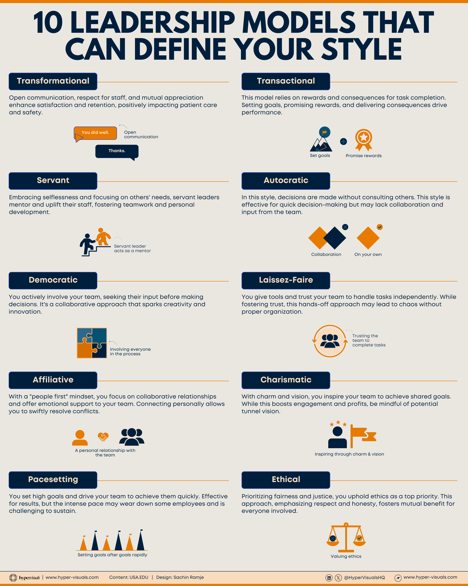

# Leadership Models

## Overview

Understanding different leadership styles helps you identify your own approach and adapt your leadership style to different situations and team needs.

## Leadership Styles

### 1. Transformational

**Description:** Open communication, respect for staff, and mutual appreciation enhance satisfaction and retention, positively impacting patient care and safety.

**Key Characteristics:**
- Open communication
- Respect for staff
- Mutual appreciation
- Enhanced satisfaction and retention
- Positive impact on outcomes

**Best For:** Organizations needing change, innovation, and employee engagement

---

### 2. Servant

**Description:** Embracing selflessness and focusing on others' needs, servant leaders mentor and uplift their staff, fostering teamwork and personal development.

**Key Characteristics:**
- Selflessness
- Focus on others' needs
- Mentoring approach
- Teamwork emphasis
- Personal development focus

**Best For:** Building strong teams, developing others, long-term growth

---

### 3. Democratic

**Description:** You actively involve your team, seeking their input before making decisions. It's a collaborative approach that sparks creativity and innovation.

**Key Characteristics:**
- Team involvement in decisions
- Collaborative approach
- Sparks creativity
- Encourages innovation
- Input-seeking behavior

**Best For:** Creative projects, problem-solving, when team expertise is valuable

---

### 4. Affiliative

**Description:** With a 'people first' mindset, you focus on collaborative relationships and offer emotional support to your team. Connecting personally allows you to swiftly resolve conflicts.

**Key Characteristics:**
- People first mindset
- Collaborative relationships
- Emotional support
- Personal connections
- Swift conflict resolution

**Best For:** Team building, resolving conflicts, stressful situations

---

### 5. Pacesetting

**Description:** You set high goals and drive your team to achieve them quickly. Effective for results, but the intense pace may wear down some employees and is challenging to sustain.

**Key Characteristics:**
- High goal setting
- Fast-paced achievement
- Results-oriented
- Intense pace
- May cause burnout

**Best For:** Highly motivated teams, short-term projects, when quick results are needed

---

### 6. Transactional

**Description:** This model relies on rewards and consequences for task completion. Setting goals, promising rewards, and delivering consequences drive performance.

**Key Characteristics:**
- Reward-based system
- Clear consequences
- Goal-oriented
- Performance-driven
- Structured approach

**Best For:** Clear objectives, routine tasks, performance-based environments

---

### 7. Autocratic

**Description:** In this style, decisions are made without consulting others. This style is effective for quick decision-making but may lack collaboration and input from the team.

**Key Characteristics:**
- Quick decision-making
- No team consultation
- Direct control
- Limited collaboration
- Efficient in crises

**Best For:** Emergency situations, when quick decisions are critical, inexperienced teams

---

### 8. Laissez-Faire

**Description:** You give tools and trust your team to handle tasks independently. While fostering trust, this hands-off approach may lead to chaos without proper organization.

**Key Characteristics:**
- High trust in team
- Hands-off approach
- Independence
- May lack structure
- Requires self-motivated team

**Best For:** Experienced, self-motivated teams, creative projects, research environments

---

### 9. Charismatic

**Description:** With charm and vision, you inspire your team to achieve shared goals. While this boosts engagement and profits, be mindful of potential tunnel vision.

**Key Characteristics:**
- Charm and charisma
- Vision-driven
- Inspirational
- High engagement
- Risk of tunnel vision

**Best For:** Inspiring change, rallying teams, vision-driven projects

---

### 10. Ethical

**Description:** Prioritizing fairness and justice, you uphold ethics as a top priority. This approach, emphasizing respect and honesty, fosters mutual benefit for everyone involved.

**Key Characteristics:**
- Fairness and justice
- Ethics as priority
- Respect and honesty
- Mutual benefit
- Long-term focus

**Best For:** Building trust, ethical organizations, long-term relationships

---

## Choosing the Right Leadership Style

### Factors to Consider

- **Team Experience:** Experienced teams may benefit from democratic or laissez-faire, while new teams may need more guidance
- **Urgency:** Autocratic or pacesetting for urgent situations, democratic for important but not urgent decisions
- **Task Type:** Routine tasks suit transactional, creative tasks suit democratic or transformational
- **Organizational Culture:** Match style to organizational values and expectations
- **Team Needs:** Consider what the team needs most - direction, support, or autonomy

### Situational Leadership

The most effective leaders adapt their style to the situation:
- Use different styles for different team members
- Adjust based on project phase
- Consider organizational context
- Balance multiple approaches

## Developing Your Leadership Style

1. **Assess Your Current Style:** Reflect on your natural tendencies
2. **Identify Gaps:** Determine which styles you need to develop
3. **Practice Flexibility:** Work on adapting to different situations
4. **Seek Feedback:** Ask team members about your leadership approach
5. **Continuous Learning:** Study different leadership models and techniques

## Resources

- [ ] Add resources and links here

