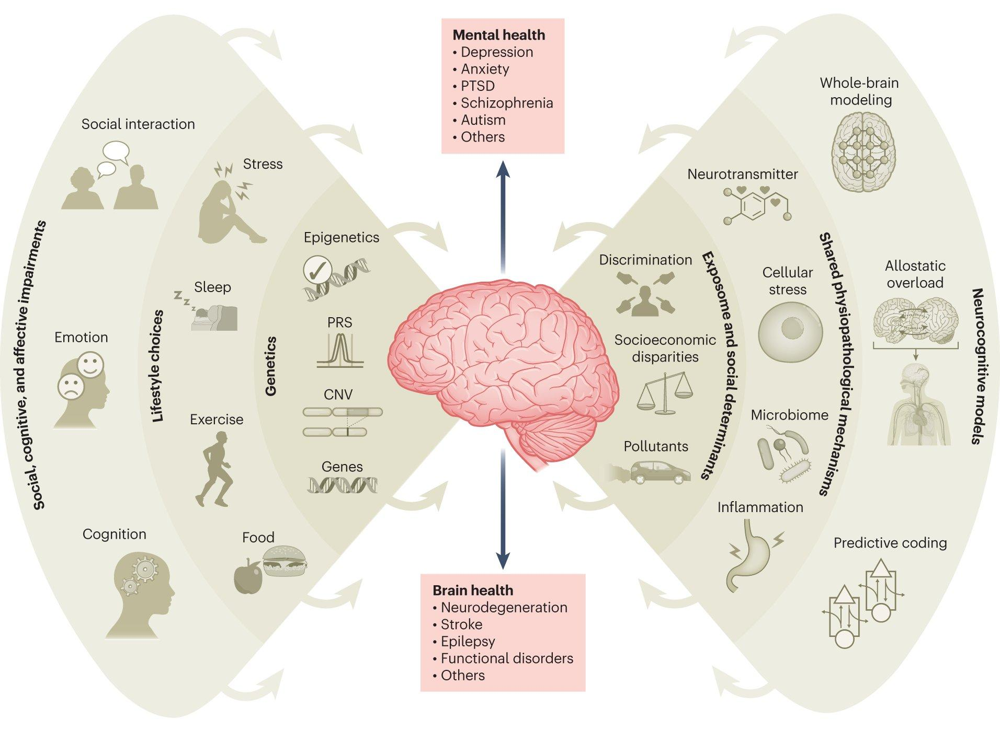

# Self-Management

- **Mindset and Attitude**
    - [Bias recognition](./bias/bias.md)
    - [Proactivity](./proactive/Proactivity.md)
    - [Mindset](./Mindset.md) — Growth mindset, resilience, positivity
    - [Habit Systems](./Habit-Systems.md)
    - [Energy Management](./Energy-Management.md)
    - [Review & Reflection Systems](./Review-Reflection-Systems.md)
    - [Work-Life Integration](./Work-Life-Integration.md) — See also [Boundaries](../Interpersonal-Development/Boundaries.md) for communicating and maintaining boundaries with others.
    - [Financial Productivity](./Financial-Productivity.md)
- **Motivation and Goal Setting**
    - [Motivation Drivers](./motivation/Motivation-Drivers.md)
    - [Goal Setting and Achievement](./Goal-Setting.md)
    - [Overcoming Procrastination](./Procrastination.md)
- **Health and Well-being**
    - Physical Health ([Exercise](./Exercise.md), [Nutrition](./Eat_Drink.md))
    - Mental Health ([Stress Management](./Stress-Management-Techniques.md), [Mindfulness](./Meditate.md))
    - [Sleep and Rest](./sleep/Sleep.md)
    - [Getting Organized](./Getting-Organized.md) — Home, desk, tech, email, and to-dos
- [Burnout Prevention & Recovery](./Burnout-Prevention-Recovery.md)
- [Recovery & Deliberate Rest](./Recovery-Rest.md)
- [Routines](./Routines.md) — Morning and evening routines
- [Workspace & Environment Optimization](./Workspace-Environment-Optimization.md)

# Health

[How to Avoid Computer Eye Strain and Keep Your Eyes Healthy](https://www.howtogeek.com/54872/how-to-avoid-computer-eye-strain-and-keep-your-eyes-healthy/ "How to Avoid Computer Eye Strain and Keep Your Eyes Healthy")

[Couchmaster – game better from your couch ](http://www.redferret.net/?p=58026)

[How to Stay Healthy When You Sit at a Desk All Day ](https://www.lifesavvy.com/608/how-to-stay-healthy-when-you-sit-at-a-desk-all-day/)

[Five Things To Do When Planning For Your Digital Death ](https://lifehacker.com/five-things-to-do-when-planning-for-your-digital-death-1826496843)

[How to Change Your Personality](https://lifehacker.com/how-to-change-your-personality-1830317055)

1. [Eat_Drink](./Eat_Drink.md) Healthily 
2. Get Adequate [Sleep](./sleep/Sleep.md) (Rest regularly)
3. [Exercise](./Exercise.md) Daily (Sport/Walk)
4. Maintain Good [Posture](./posture/Posture.md)
5. [Meditate](./Meditate.md)
6. Read Books

Holy triad of Mental Health:

- Focus on one thing
- Always be thankful
- Be open to someone

Detailed tips for better Mental Health

- Be kind to yourself
- More is necessary not better
- Keep expectations realistic
- Old patterns will naturally start to appear
- Remember that other people cannot read your mind or anticipate your needs
- Family is another way of saying "people who love, support and care about me"
- Pause and think through any major announcements or decisions you want to make
- Plan sanity time-outs
- Choose your battles
- Do something silly

