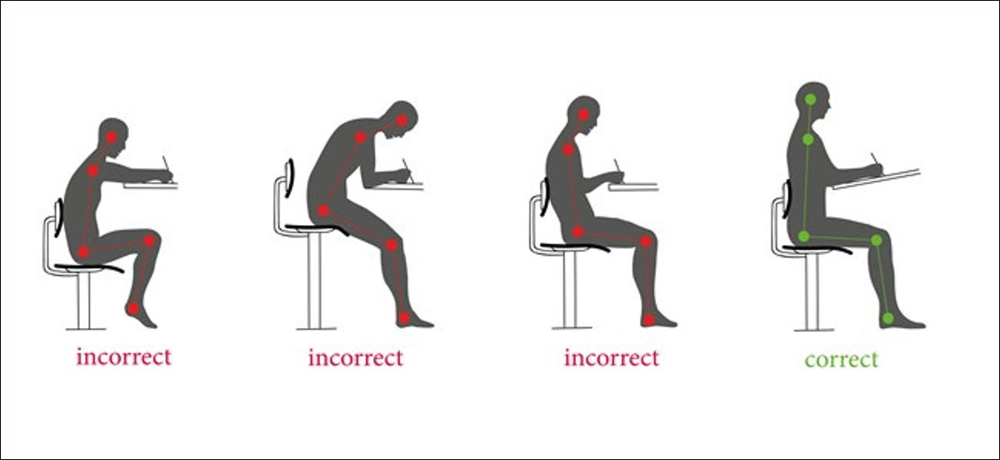
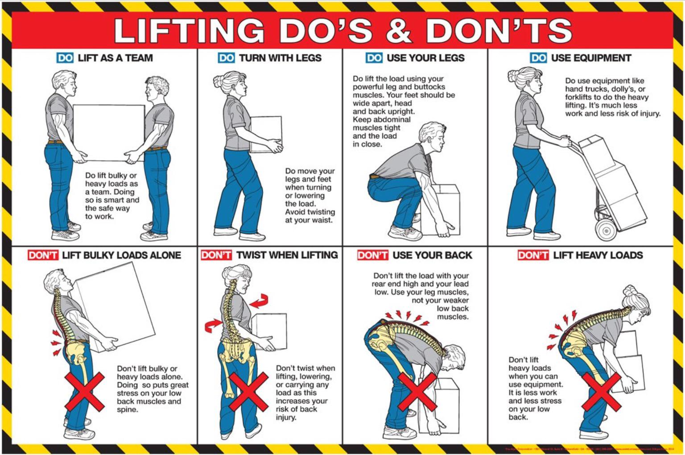

## Good Posture

[Six Tips to Help Save Yourself from Poor Computer Posture ](https://www.howtogeek.com/349796/six-tips-to-help-save-yourself-from-poor-computer-posture/)

## Back Pain: The Real Facts

1. Ongoing back pain can be scary—but it’s rarely dangerous
Persistent back pain can be distressing, but it’s very unlikely to be life-threatening or lead to permanent disability.

2. Getting older doesn’t cause back pain
Although back pain is common, research shows aging itself doesn’t cause or worsen it. People of any age can improve with the right approach.

3. Long-lasting back pain usually isn’t due to serious damage
The back is strong. If pain lasts, it often reflects sensitivity of the nervous system rather than ongoing injury. Many cases start without clear damage.

4. Scans rarely explain back pain
MRI and X-ray findings like disc bulges or degeneration are common—even in people without pain. These results don’t reliably predict pain levels or recovery.

5. Pain with movement doesn’t mean you’re harming yourself
Feeling pain during movement doesn’t automatically signal damage. Gentle, progressive movement is safe and often helps reduce pain over time.

6. Poor posture doesn’t cause back pain
There’s no single “correct” posture. Sitting, bending, and lifting are safe in many forms, and variety is actually good for your back.

7. A “weak core” is not the cause of back pain
Back pain isn’t caused by weak core muscles. Over-tensing the core can even make things worse. Learning to relax and move normally matters more.

8. Backs don’t wear out from everyday use
Movement and loading make the back stronger, not weaker. Walking, bending, lifting, and exercise are safe when built up gradually.

9. Pain flare-ups don’t mean you’ve caused damage
Flare-ups are common and usually linked to stress, fatigue, poor sleep, or inactivity—not injury. Staying calm and moving gently helps recovery.

10. Injections, surgery, and strong medications are rarely the answer
For most persistent back pain, these options offer limited benefit and carry risks. Education, movement, and self-management are often more effective.

Original Source / Reference

O’Sullivan P, Caneiro JP, O’Sullivan K, Bunzli S, Wernli K, Mary O’Keeffe.
Back Pain Facts.
British Journal of Sports Medicine (BJSM), 2019.

