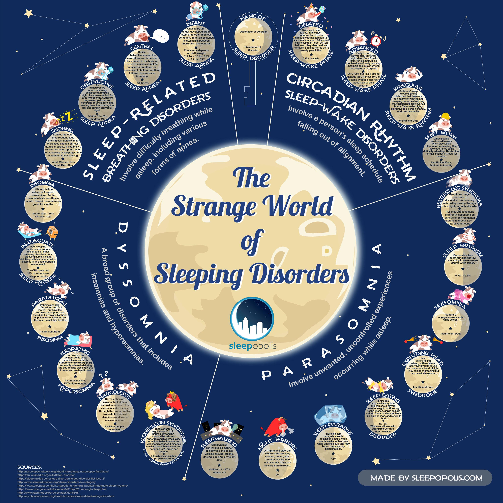
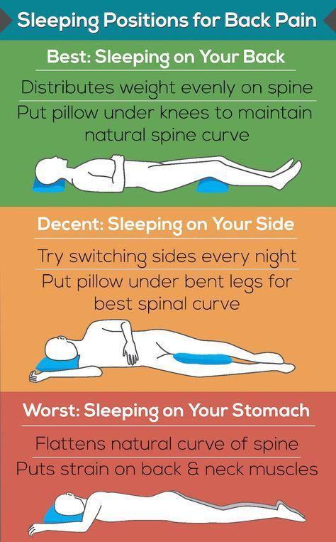
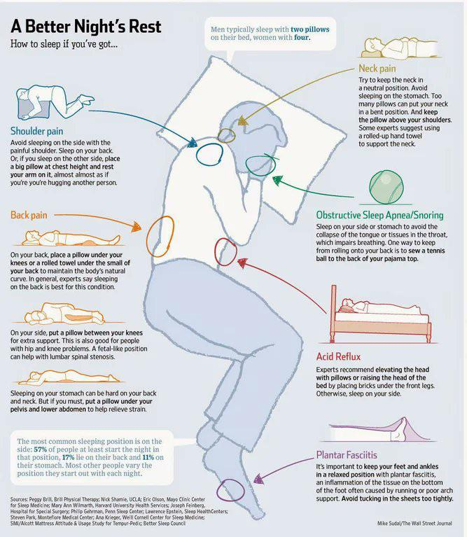

# Sleep

## Overview

Sleep supports health, learning, emotional regulation, and sustainable performance. Needs and sleep patterns vary, so use trends in daytime function as well as time in bed when evaluating a routine.

## Support Consistent Sleep

- Keep wake time reasonably consistent, including after a poor night.
- Create a repeatable wind-down period with lower stimulation.
- Make the room as dark, quiet, comfortable, and cool as practical.
- Notice how caffeine, alcohol, heavy meals, exercise timing, and late screen use affect you.
- Use the bed primarily for sleep when possible.
- Get daylight and movement during the day.

## When Sleep Does Not Come

- Avoid turning the clock into a performance score.
- Use a quiet, low-stimulation activity until sleepiness returns.
- Record persistent patterns and relevant factors rather than changing many variables at once.
- Seek qualified care for ongoing insomnia, severe daytime sleepiness, breathing interruptions, unusual movements, or other concerning symptoms.

## Related

- [Energy Management](../Energy-Management.md)
- [Routines](../Routines.md)
- [Recovery and Deliberate Rest](../Recovery-Rest.md)
- [Stress Management](../Stress-Management-Techniques.md)

## Archived Visual References

These graphics are retained as collected resources and should not replace individualized clinical guidance.

